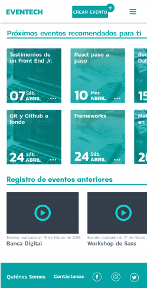

# Eventech

Web App que permite crear y asistir a eventos, a la vez de difundir conocimiento en el área tech.

Proyecto realizado para la hackathon final del bootcamp - Laboratoria 2018


**OBJETIVOS**

- Crear e inscribirse a eventos en el área tech.
- Potenciar el conocimiento en el área tech, por medio de registros audiovisuales de los eventos.
- Entregar contenido personalizado según las preferencias del usuario y de manera gratuita.

En primera instancia decidimos hacer una reunión como equipo donde analizamos los requerimientos de este reto, y definimos roles según las fortalezas y habilidades de cada una de las integrantes, con el objetivo de trabajar de manera eficaz.
Y nos planificamos por medio de un To Do para ir cumpliendo tareas.


<a href="https://drive.google.com/drive/folders/1dp8nrbvlGT4k7xtkvs2wPAOuiylngAB6">Ver To Do</a>

**ENCUESTA**

El objetivo de la encuesta ha sido validar cuáles son los insights más importantes para crear una solución sólida que se refleje en el producto final o MVP.


<a href="https://docs.google.com/forms/d/e/1FAIpQLSdPVBScWy6kLkMwVStGRJlw81bfA9penP1anPO3_RoY8OBY-Q/viewform">Ver Encuesta</a>

**OBSERVACIONES DE LA ENCUESTA**

Se registró un total de 43 usuarios durante la encuesta realizada, donde percibimos que: 

El 80% comparte sus conocimientos por internet.
Dentro de los medios disponibles de aprendizaje online la mayoría prefiere youtube, esto significa que tenemos una oportunidad de mercado en los usuarios que prefieren plataformas audiovisuales. 
Adicionalmente un porcentaje cercano al 50% de los usuarios estudian por internet.
Los usuarios también estudian u obtienen sus conocimientos de cursos online eventos, meetups y en workshops.

Según nuestra investigación podemos concluir que no existe una plataforma que reúna todos estos conocimientos y los almacene en un solo servidor. 
Por esta razón nace EVENTECH, una plataforma que potencia el conocimiento del área tech en Chile, ya que es un área que está en constante crecimiento, tomando registro audiovisual de cada una de charlas y workshops realizados.

Por medio de la encuesta pudimos rescatar diferentes insights que nos sirvieron para validar el contenido y llegar a una solución viable.


<a href="https://drive.google.com/drive/folders/1EPtY8ChBzrmb-oDiI3mBrPGhN9MJI8Dy">Ver detalles de la observación</a>

Luego con los resultados de la misma encuesta creamos un “golden circle” para entender decisiones clave que determinan cómo será nuestro producto y que es lo que ofrecerá. 


<a href="https://drive.google.com/drive/folders/16-W6pZEuAysAvC8AswNgUrIZxs-MvkoG">Ver Golden circle</a>

**NECESIDADES**

- El usuario necesita una plataforma de fácil acceso y sin cobros adicionales, que sea capaz de entregar conocimiento constante y actualizado.
- El usuario se informa a través de medios digitales pero, no cuenta con una plataforma de eventos en el área de la tecnología que los unifique a todos.
- El usuario al no poder asistir a un evento pierde la capacidad de obtener ese conocimiento.

Una vez detectadas las necesidades de los usuarios, realizamos una síntesis previa de la información obtenida por medio de la investigación, decidimos definir la estructura de contenidos, que fué clave para orientarnos en el proceso de ideación del proyecto.

De esta manera pudimos determinar cuál será la experiencia que tendrá un usuario cuando acceda a la web app. Y así poder determinar dónde estarán ubicados los diferentes contenidos de navegación.


<a href="https://docs.google.com/drawings/d/1seEvzAS_f_bVli9rqNwTQI6kCNffvYRDEZ7PD6my73c/edit">Ver estructura de contenidos</a>

A partir de esta estructura de contenidos logramos crear el Sketch inicial de nuestra propuesta, para trabajar en conjunto con nuestro equipo front end y poder desarrollar de manera ágil y eficiente nuestro MVP.


<a href="https://drive.google.com/drive/folders/1uHs2YAc-mBzoDG7TfKZOOr2BhbYRY9Bm">Ver sketch</a>

Una vez que realizamos el proceso de la creación del sketch, logramos realizar el diagrama de flujo de la web app, donde se puede visualizar el recorrido que realizarán los usuarios al momento de ingresar a la plataforma.


<a href="https://drive.google.com/drive/folders/16kiPQUgqybKhL-bl8I7DfLekgMR6YHCf">Ver diagrama de flujo</a>

El Sketch lo fuimos afinando a medida que realizamos diferentes testeos para lograr percibir cuáles son los momentos más débiles en la interacción del usuario con la plataforma.


<a href="https://marvelapp.com/64bcg0b/screen/40119973">Ver sketch testeado</a>


<a href="https://drive.google.com/drive/folders/1_de0O1NBzbmBM9Zj01uhS7LuN6Tu6yqR">Ver test de usuarios</a>

Para realizar el testeo se consultó a 5 posibles usuarios de nuestra web app.
- Los resultados del testeo arrojaron que 1 de 5 usuarios no logró completar la tarea de inscribirse correctamente en la web app. Fué porque el usuario pensó que iba a volver a anular cada vez al momento de inscribirse.
- Hubieron dos usuarios que buscaron el crear evento en el menú desplegable y no donde nosotras situamos el botón inicialmente. en conclusión creemos que es correcto dejarlo en el mismo lugar porque si funcionó para otros usuarios, pero también incluir esa alternativa en el menú desplegable.

<a href="https://marvelapp.com/64bcg0b/screen/40119973">Ver sketch testeado</a>

**SOLUCIÓN**
Una web app que sea capaz de dejar un registro del material audiovisual, de difundir y de entregar conocimiento para el área de la tecnología.


**PROTOTIPO FINAL, MVP**

Como el proyecto se enfoca en el área tech y en los eventos, le asignamos por nombre EVENTECH.
Los colores y tipografías son acordes a los conceptos asociados a la tecnología y modernidad.

<a href="https://marvelapp.com/14hc4b76">Navegar Prototipo</a>

## Hosting

[Heroku](https://eventoslab.herokuapp.com/)

[GH-PAGES](https://vpsa23.github.io/eventos/)

## Development

Made with React and React-Bootstrap.

### React

This library was used for component creation and its virtual DOM characteristics.

```
npm install react
```
```
npm install react-dom
```

## Tech requirements

The project was developed with the following dependencies
+ Dev dependencies
   - GH-PAGES `^1.1.0`

+ Product dependencies
   - Firebase `^4.11.0`
   - React `^16.2.0`
   - React-DOM `^16.2.0`
   - React Bootstrap `^0.32.1`
   - React Bootstrap Date Picker `^5.1.0`
   - React-Fontawesome `^1.6.1`
   - React Scripts `1.1.1`

## Prototype



## Authors

### UX Designer
* **Jocelyn González**
* **Valentina**

### Front End Developers
* **Viviana Marcelo** - [skyblue16](https://github.com/skyblue16)
* **Valeria** - [vpsa23](https://github.com/vpsa23)
* **Almendra Oyarzún** - [bimiriya](https://github.com/bimiriya)


## License

This project is licensed under the MIT License - see the [LICENSE.md](LICENSE.md) file for details